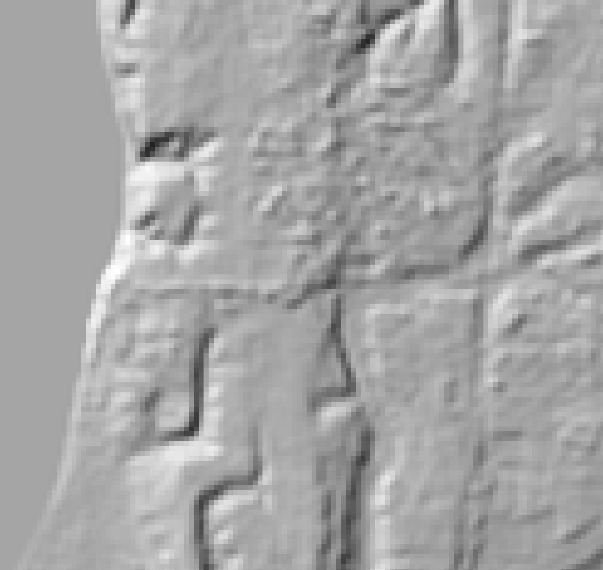
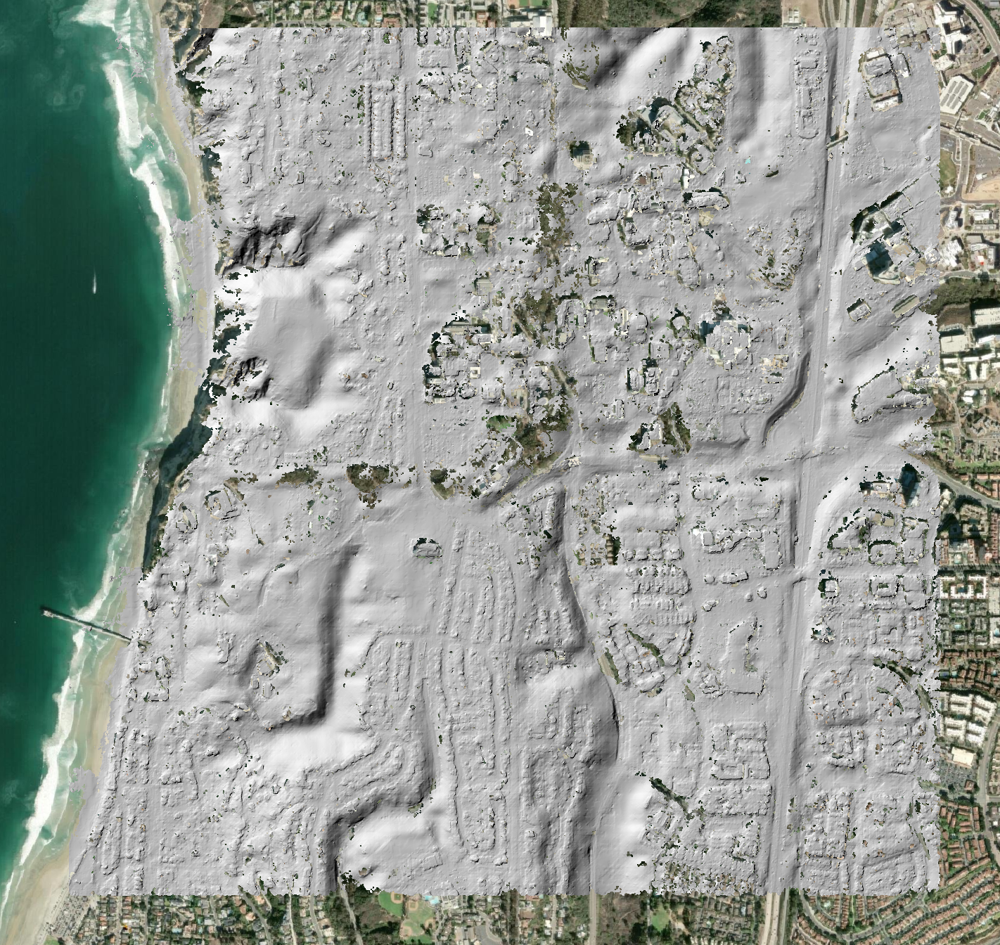
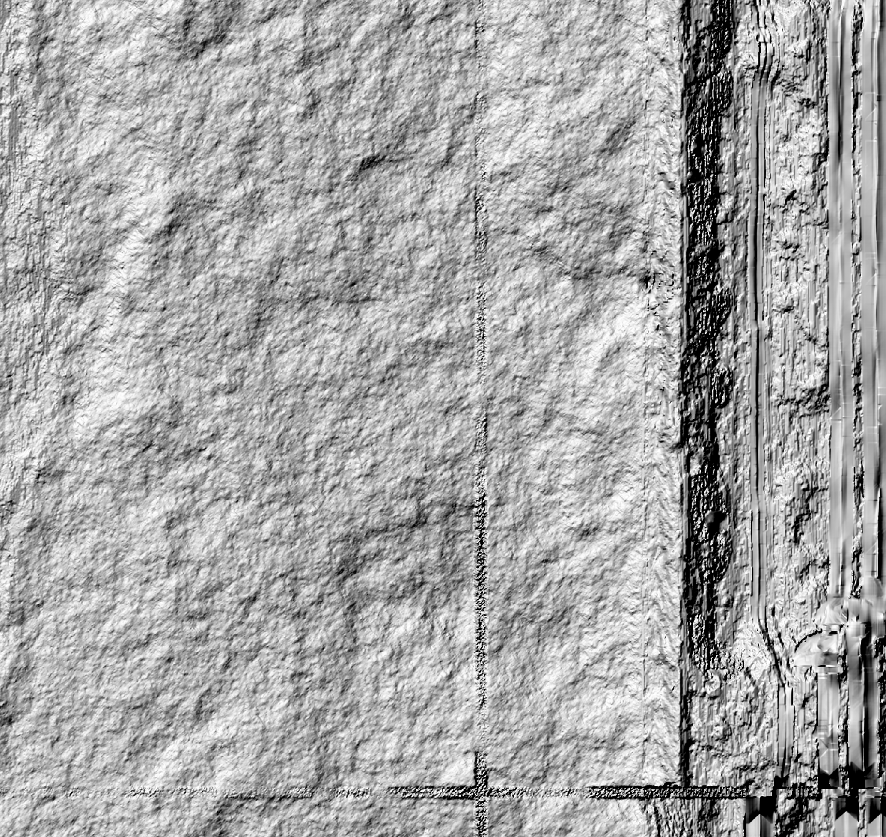

# SETSM vs ASP — SpaceNet UCSD WorldView-3

Compare DEMs produced by two open-source stereo photogrammetry pipelines on the same WorldView-3 stereo pair:

- **ASP** (NASA Ames Stereo Pipeline) — processed in the [UCSD notebook](../examples/notebooks/worldview_spacenet_ucsd_stereo)
- **[SETSM](https://github.com/setsmdeveloper/SETSM)** (Surface Extraction with TIN-based Search-space Minimization) — Ohio State / Polar Geospatial Center

Both pipelines accept raw satellite imagery with RPC camera models and produce gridded DSMs.

## Source Data

IARPA CORE3D SpaceNet UCSD dataset — two WorldView-3 panchromatic acquisitions:

| Catalog ID | Date | Off-nadir | Image size |
|---|---|---|---|
| 1040010007A3D100 | 2015-02-11 | 24.3° | 43008 x 44032 px |
| 1040010007A93700 | 2015-02-12 | 9.6° | 43008 x 46080 px |

## Approach

SETSM is open-source (Apache 2.0), pure C++ with no GPU requirement. We built and ran it via Docker to avoid host dependency conflicts.

SETSM works on raw (non-mapprojected) imagery with RPC camera models read from DigitalGlobe XML metadata files. Since the full images are ~800 MB each, we first attempted processing on a cropped sub-scene matching the ASP processing region, then attempted the full scene.

:::{dropdown} Docker build details
:icon: terminal

```bash
git clone https://github.com/setsmdeveloper/SETSM.git
cd SETSM

docker build --platform linux/amd64 -t setsm -f- . <<'DOCKERFILE'
FROM ubuntu:24.04 AS builder
RUN apt-get update && apt-get install -y --no-install-recommends \
    g++ make git \
    libgeotiff-dev libtiff-dev libproj-dev libjpeg-dev zlib1g-dev \
    && rm -rf /var/lib/apt/lists/*
COPY . /opt/SETSM
WORKDIR /opt/SETSM
RUN make INCS="-I/usr/include/geotiff"

FROM ubuntu:24.04
RUN apt-get update && apt-get install -y --no-install-recommends \
    libgeotiff5 libgomp1 libtiff6 libproj25 \
    && rm -rf /var/lib/apt/lists/*
COPY --from=builder /opt/SETSM/setsm /usr/local/bin/setsm
COPY --from=builder /opt/SETSM/default.txt /usr/local/share/setsm/default.txt
WORKDIR /data
ENTRYPOINT ["sh", "-c", "cp /usr/local/share/setsm/default.txt /data/default.txt 2>/dev/null; exec setsm \"$@\"", "--"]
DOCKERFILE
```

Multi-stage build — the final image contains only the `setsm` binary and runtime libraries. The `default.txt` config file is bundled and auto-copied at runtime (SETSM requires it in the working directory).
:::

:::{dropdown} Image cropping and RPC adjustment
:icon: scissors

SETSM reads RPCs from DigitalGlobe XML files (not from GeoTIFF metadata). To crop the images, we needed to adjust the RPC offsets in both the GeoTIFF and the XML.

**Why cropping preserves RPCs:**

The RPC model maps ground coordinates to image coordinates:

```
line = f(lat, lon, height) * LINE_SCALE + LINE_OFFSET
sample = g(lat, lon, height) * SAMP_SCALE + SAMP_OFFSET
```

When cropping at pixel offset `(col_off, row_off)`, only the offsets change:

- `new LINE_OFFSET = old LINE_OFFSET - row_off`
- `new SAMP_OFFSET = old SAMP_OFFSET - col_off`

All polynomial coefficients and scale factors remain identical.

**Procedure:**

1. Defined geographic extent matching the ASP crop area (UTM 11N: 476000–479000 E, 3635600–3638600 N) plus 500 m buffer.
2. Used GDAL's RPC transformer to compute pixel windows per image.
3. Cropped NTF to GeoTIFF via ASP's `gdal_translate -srcwin` (JP2OpenJPEG driver required for JPEG2000-compressed NTFs).
4. Copied original XMLs and updated `LINEOFFSET`, `SAMPOFFSET`, `NUMROWS`, `NUMCOLUMNS`, and `TIL` tile extents.
5. Verified XML and GeoTIFF RPC offsets match, and that center pixels map to identical ground coordinates as the originals (zero error).

| Image | Crop srcwin (col, row, w, h) | Cropped size |
|---|---|---|
| 1040010007A3D100 | 11189, 16662, 10575, 12163 | 10575 x 12163 px |
| 1040010007A93700 | 9318, 17173, 12789, 12927 | 12789 x 12927 px |
:::

## Results

### Run 1: Cropped images

SETSM v4.3.16 on the cropped images via Docker (`linux/amd64` emulation on Apple Silicon M2).

```bash
docker run --platform linux/amd64 --rm \
    -v /path/to/data:/data -w /data setsm \
    -image 1040010007A3D100_P001.tif -image 1040010007A93700_P001.tif \
    -outpath /data/results -outres 2 -mem 16 -minH 0 -maxH 300
```

| Metric | Value |
|---|---|
| Computation time | ~115 minutes |
| Peak memory | 3.96 GB |
| Output DEM | 1986 x 2019 px, 2 m, EPSG:32611 |
| Convergence angle | 35.9° |

**Result: Poor quality.** The hillshade showed unreasonable noise and elevation blunders throughout, rendering quality analysis unnecessary.

#### Hillshade Comparison

::::{grid} 3
:::{grid-item}

**Copernicus 30m DEM**
:::
:::{grid-item}

**ASP 2m DEM**
:::
:::{grid-item}

**SETSM 2m DEM**
:::
::::

:::{dropdown} Additional notes
:icon: note

- Ortho TIFFs were written with corrupt LZW compression (unreadable in QGIS/GDAL) — likely a libtiff version issue inside the Docker container. The DEM and matchtag were fine.
- The SETSM user manual's `-seed <filepath> <sigma>` flag was investigated but is documented as a performance optimization only, not a quality improvement: *"We caution that it is better to not use a seed DEM if possible, as it can only negatively impact the quality of the SETSM DEM."*
:::

### Run 2: Full scene — OOM failure

Attempted the full uncropped images (43k×44k and 43k×46k px) to rule out cropping as the cause. SETSM loads both full images into memory regardless of output resolution — two UInt16 images plus pyramids required well over 14 GB. The container was OOM-killed (exit code 137) at both `--memory 10g` and `--memory 14g` on a 16 GB machine. Full-scene SETSM processing is not feasible locally.

## Conclusion

The cropped-image run produced a DEM with excessive noise and blunders, and the full-scene run could not complete on a 16 GB laptop due to SETSM's memory requirements. A proper comparison would require a machine with more RAM (the SETSM manual recommends 12+ cores with proportionally more memory for full-resolution commercial imagery).

## References

- [SETSM repository](https://github.com/setsmdeveloper/SETSM)
- [SETSM user manual](https://github.com/setsmdeveloper/SETSM/blob/master/SETSM_User_manual.pdf)
- Noh & Howat (2015), "Automated stereo-photogrammetric DEM generation at high latitudes: Surface Extraction with TIN-based Search-space Minimization (SETSM) validation and demonstration over glaciated regions", *GIScience & Remote Sensing*, 52(2), 198-217.
